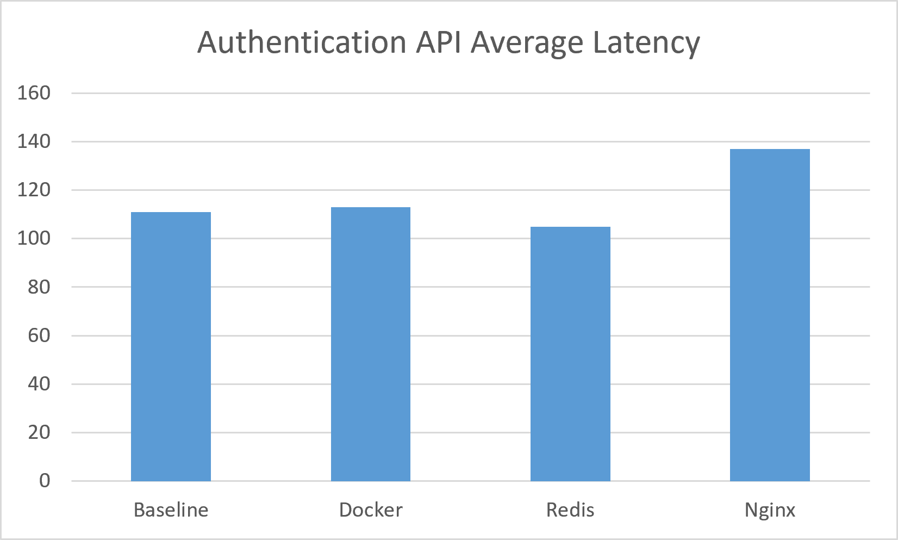
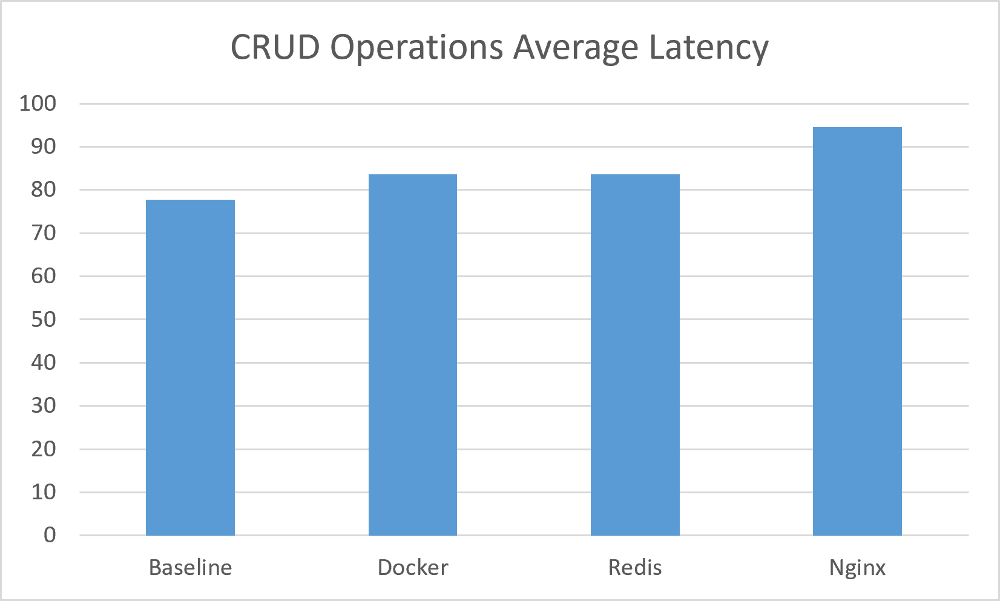
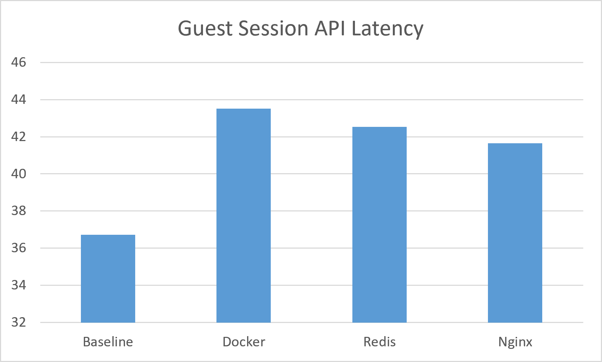
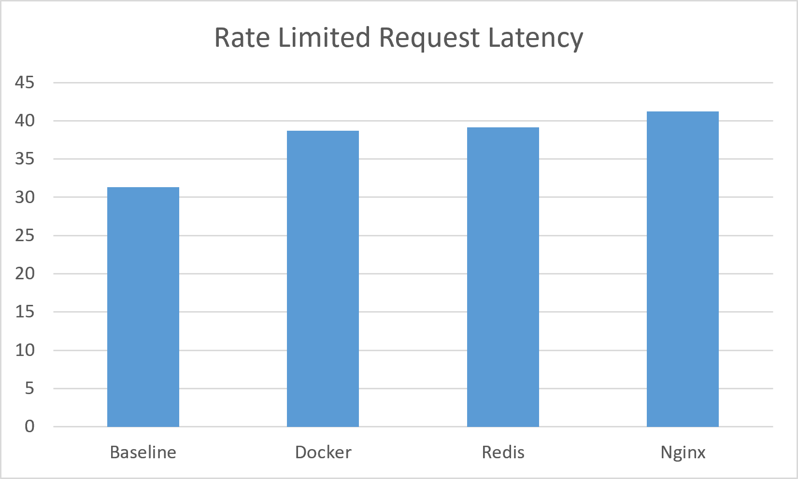
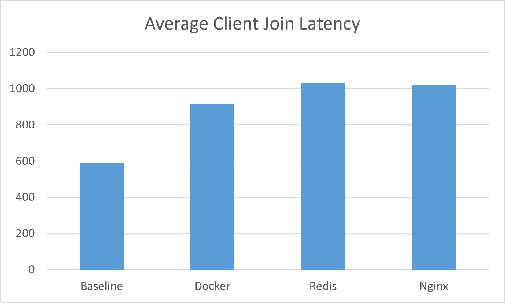
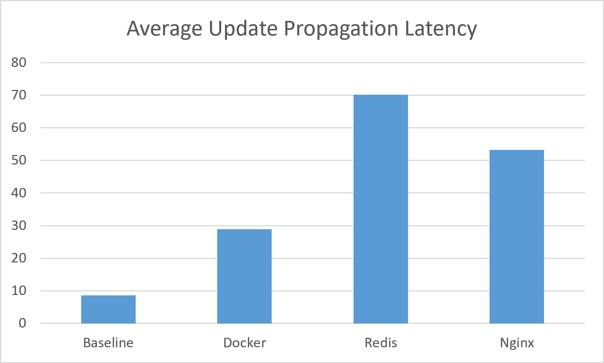
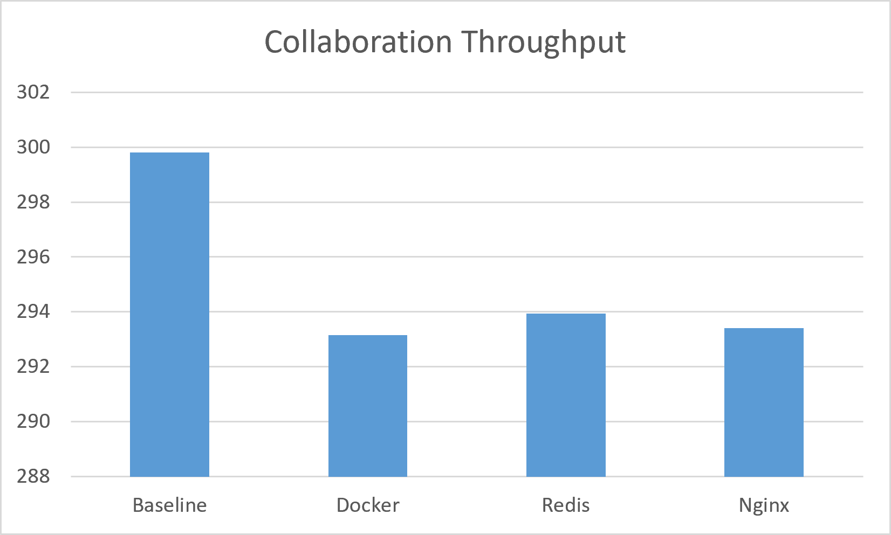
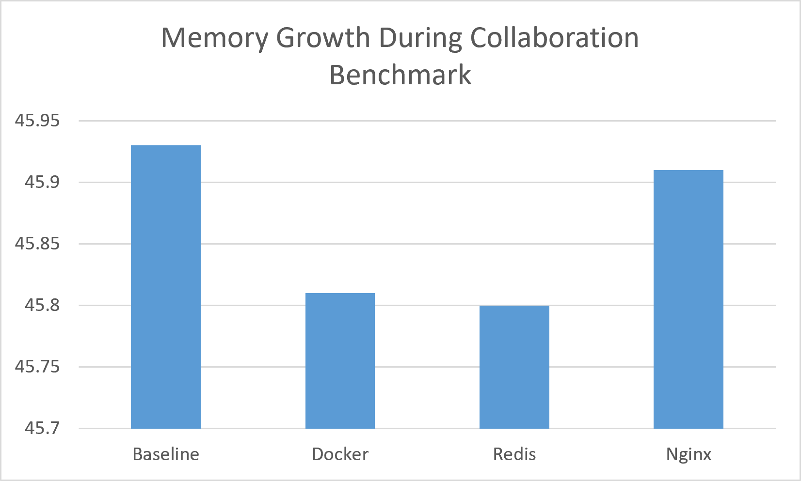
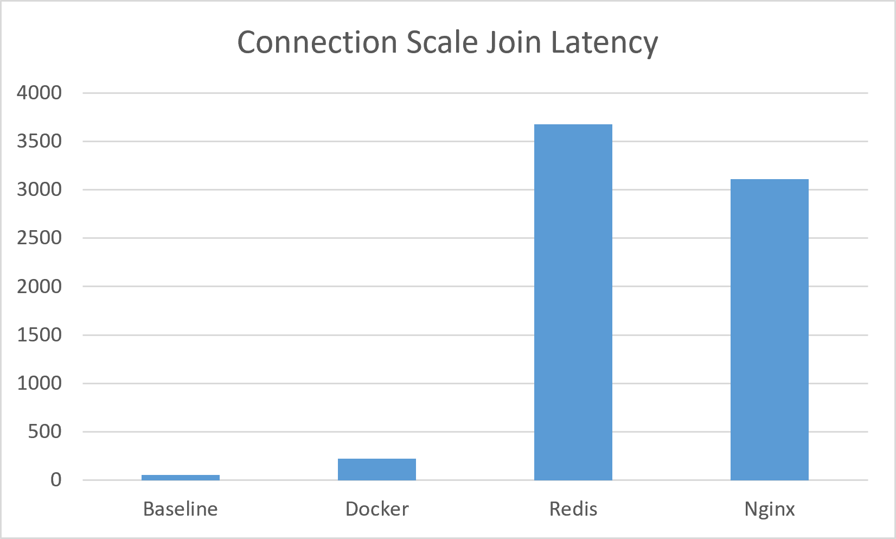
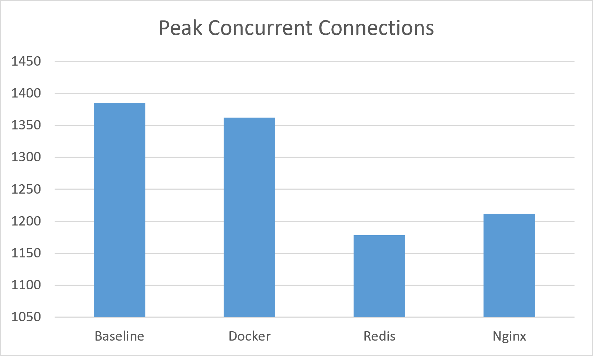

# SyncDocs Performance Evaluation Report

---

## 1. Objective

The objective of this evaluation was to measure the performance impact of progressively introducing production infrastructure components into SyncDocs. Four deployment stages were evaluated:

- Native Node.js
- Docker
- Docker + Redis
- Docker + Redis + Nginx

Each stage was benchmarked with the same HTTP and real-time collaboration workloads so that the effect of each added infrastructure layer could be isolated and compared directly against the previous stage.

---

## 2. Test Environment

All benchmarks were executed on the following hardware and software configuration.

### Hardware

| Component | Specification |
|---|---|
| Operating System | Windows 11 |
| CPU | Intel Core i5-12450HX (12th Gen, 8 Cores / 12 Threads) |
| Memory | 16 GB DDR5 @ 4800 MT/s |
| Dedicated GPU | NVIDIA GeForce RTX 3050 Laptop GPU (6 GB VRAM) |
| Integrated GPU | Intel UHD Graphics |

### Software

| Component | Version |
|---|---|
| Node.js | 22.18.0 |
| npm | 11.5.2 |
| Docker Desktop | 29.6.2 |
| Docker Compose | 5.3.1 |
| Redis | 7-alpine |
| Nginx | 1.31.3 (Alpine) |
| Socket.IO | 4.8.3 |
| Yjs | 13.6.31 |
| k6 | 2.1.0 |
| MongoDB Atlas | MongoDB 8.0.29 |
| Browser | Google Chrome (Latest Stable) |

---

## 3. Multi-Instance Deployment Architecture

The following architecture was used to evaluate the multi-instance deployment configuration.
Nginx distributes incoming HTTP and WebSocket traffic across two backend instances, while Redis Pub/Sub synchronizes Socket.IO events between backend instances.
MongoDB Atlas provides persistent storage shared by both backend instances.

  

  Figure 3.1. Multi-instance deployment architecture using Nginx, Redis Pub/Sub, two Node.js backend instances and MongoDB Atlas.

---

## 4. Methodology

**HTTP Benchmarks** (via k6)
- Authentication
- CRUD
- Guest access
- Rate limiting

**Collaboration Benchmarks** (custom harness)
- Connection scale
- Merge latency

Each HTTP benchmark was executed three times and the average values are reported. Each connection-scale test was run five times per environment and averaged. Merge-latency was run once per client count (10 / 50 / 100) per environment. All four environments (baseline, docker, redis, nginx) were tested with an identical workload definition per test type.

---

## 5. Detailed Results

### 5.0 Summary Comparison

A quick overview before the detailed breakdown below. All figures are at 100 concurrent clients where applicable (merge-latency, throughput, memory).

| Benchmark | Baseline | Docker | Redis | Nginx |
|---|---:|---:|---:|---:|
| Authentication (ms) | 110.88 | 113.00 | 104.80 | 136.84 |
| CRUD (ms) | 77.80 | 83.64 | 83.55 | 94.53 |
| Guest (ms) | 36.72 | 43.51 | 42.53 | 41.64 |
| Rate Limit (ms) | 31.30 | 38.73 | 39.14 | 41.21 |
| Join Latency (ms) | 588.99 | 914.09 | 1,032.53 | 1,018.91 |
| Propagation (ms) | 8.58 | 28.88 | 70.13 | 53.23 |
| Throughput (updates/sec) | 299.80 | 293.15 | 293.93 | 293.41 |
| Peak Connections | 1,385 | 1,362 | 1,178 | 1,212 |
| Connection Join Latency (ms) | 56.75 | 222.61 | 3,674.62 | 3,109.01 |
| Memory Growth — RSS Delta (MB) | 45.93 | 45.81 | 45.80 | 45.91 |

**At a glance:** HTTP endpoints (rows 1-4) stay flat across all four stages — the infrastructure isn't the bottleneck there. Real-time metrics (rows 5-9) diverge sharply once Redis/Nginx are introduced, while memory growth (row 10) stays constant across every stage — confirming the added latency is a communication-overhead cost, not a memory or leak-driven problem. See Sections 6 and 7 for the full explanation.

### 5.1 Authentication

| Environment | Avg Latency | P95 Latency | Req/sec | Failed |
|---|---:|---:|---:|---:|
| baseline | 110.88 ms | 138.25 ms | 23.29 | 0.00% |
| docker | 113.00 ms | 157.64 ms | 23.35 | 0.00% |
| redis | 104.80 ms | 137.32 ms | 23.55 | 0.00% |
| nginx | 136.84 ms | 192.48 ms | 22.88 | 0.00% |

  

  Figure 5.1 Authentication latency across deployment stages.

**Interpretation:** Latency stays within a tight band across all four stages, with nginx showing the expected ~20-25% increase from the additional reverse-proxy hop. No failures in any environment. Authentication is not a bottleneck at any stage.

### 5.2 CRUD

| Environment | Avg Latency | P95 Latency | Req/sec | Failed |
|---|---:|---:|---:|---:|
| baseline | 77.80 ms | 131.44 ms | 16.46 | 0.00% |
| docker | 83.64 ms | 131.11 ms | 16.39 | 0.00% |
| redis | 83.55 ms | 131.27 ms | 16.38 | 0.00% |
| nginx | 94.53 ms | 162.77 ms | 16.01 | 0.00% |

  

  Figure 5.2. CRUD operation latency across deployment stages.

**Interpretation:** Same pattern as authentication: there is a modest, consistent overhead from containerization and proxying, with no failures and essentially unchanged throughput. CRUD operations scale cleanly through every infrastructure layer.

### 5.3 Guest

| Environment | Avg Latency | P95 Latency | Req/sec | Failed |
|---|---:|---:|---:|---:|
| baseline | 36.72 ms | 41.74 ms | 24.90 | 0.00% |
| docker | 43.51 ms | 59.12 ms | 24.67 | 0.00% |
| redis | 42.53 ms | 47.90 ms | 24.74 | 0.00% |
| nginx | 41.64 ms | 47.31 ms | 24.71 | 0.00% |

  

  Figure 5.3. Guest access latency across deployment stages.

**Interpretation:** Guest access shows the largest *relative* jump from baseline to docker (~18%), but absolute latency remains low (under 45ms) at every stage. There is no meaningful difference between docker, redis, and nginx because the containerization step accounts for nearly all of the added cost here, not redis or nginx specifically.

### 5.4 Rate Limiting

| Environment | Avg Latency | P95 Latency | Req/sec | Failed |
|---|---:|---:|---:|---:|
| baseline | 31.30 ms | 44.30 ms | 4.30 | 20.00% |
| docker | 38.73 ms | 56.35 ms | 4.17 | 20.00% |
| redis | 39.14 ms | 56.51 ms | 4.16 | 20.00% |
| nginx | 41.21 ms | 59.50 ms | 4.12 | 20.00% |

  

  Figure 5.4. Rate-limited request latency across deployment stages.

**Interpretation:** The 20% failure rate is expected, not a defect, because it reflects the rate limiter correctly rejecting requests once a client exceeds the configured threshold. That this figure holds at exactly 20% across all four environments confirms the limiter's behavior is deterministic and unaffected by the surrounding infrastructure.

### 5.5 Merge Latency

**10 clients**

| Environment | Join Latency Avg | Update Propagation Avg | RSS Delta |
|---|---:|---:|---:|
| baseline | 494.00 ms | 4.17 ms | 0.04 MB |
| docker | 439.90 ms | 8.63 ms | 0.03 MB |
| redis | 494.10 ms | 54.19 ms | -0.05 MB |
| nginx | 559.40 ms | 48.65 ms | 11.28 MB |

**50 clients**

| Environment | Join Latency Avg | Update Propagation Avg | RSS Delta |
|---|---:|---:|---:|
| baseline | 542.12 ms | 5.99 ms | 12.91 MB |
| docker | 621.78 ms | 14.90 ms | 13.34 MB |
| redis | 928.10 ms | 49.74 ms | 12.53 MB |
| nginx | 846.34 ms | 48.89 ms | 12.75 MB |

**100 clients**

| Environment | Join Latency Avg | Update Propagation Avg | RSS Delta |
|---|---:|---:|---:|
| baseline | 588.99 ms | 8.58 ms | 45.93 MB |
| docker | 914.09 ms | 28.88 ms | 45.81 MB |
| redis | 1,032.53 ms | 70.13 ms | 45.80 MB |
| nginx | 1,018.91 ms | 53.23 ms | 45.91 MB |

  

  Figure 5.5a. Collaboration join latency by client count and deployment stage.

  

  Figure 5.5b. Update propagation latency by client count and deployment stage.

  

  Figure 5.5c. Update throughput by client count and deployment stage.

  

  Figure 5.5d. RSS memory delta by client count and deployment stage.

**Interpretation:** Two separate effects are visible here. First, RSS delta scales with client count almost identically across all four environments (~46MB at 100 clients regardless of stage); that scaling is a property of the application process itself rather than the surrounding infrastructure. Second, update propagation latency at a fixed client count grows significantly once redis/nginx are introduced (8.58ms → 53-70ms at 100 clients) because each update traverses additional communication layers (Redis Pub/Sub and/or Nginx reverse proxy) before reaching every subscribed client.

### 5.6 Connection Scale

| Environment | Avg Join Latency | P95 Join Latency | Peak Connections | Success Rate |
|---|---:|---:|---:|---:|
| baseline | 56.75 ms | 76.00 ms | 1,385 | 100% |
| docker | 222.61 ms | 818.60 ms | 1,362 | 100% |
| redis | 3,674.62 ms | 14,935.40 ms | 1,178 | 100% |
| nginx | 3,109.01 ms | 13,477.00 ms | 1,212 | 100% |

  

  Figure 5.6a. Connection join latency at scale across deployment stages.

  

  Figure 5.6b. Peak concurrent connections handled across deployment stages.

**Interpretation:** This is the most significant result in the evaluation. Avg join latency increases roughly 55-65x from baseline to redis/nginx, and P95 increases roughly 175-195x, while success rate holds at 100% throughout; connections are not failing; instead, they are queueing. Peak concurrent connections remain below the baseline in the scaled configurations, with some variation between Redis and Nginx.

*Note: these results reflect the revised, multi-document benchmark configuration described in Section 6. The far more severe failures observed during initial testing (see Section 6.1–6.3) were traced to an unrealistic single-document stress-test workload, not to the infrastructure itself, and were resolved before these figures were collected.*

---

## 6. Diagnostic Investigation

### 6.1 Problem Observed

During the initial connection-scale experiments, the benchmark produced a large number of unexpected disconnects, low connection success rates, and rapidly increasing join latency under heavy load.

### 6.2 Investigation Method

Rather than assuming the problem originated from Socket.IO, Yjs, or the infrastructure, the existing `simulateConnectionScale.js` benchmark was modified to isolate different parts of the collaboration pipeline. Four controlled experiments were executed in the baseline environment by selectively enabling and disabling the Yjs document synchronization and Awareness update logic while keeping the connection benchmark unchanged.

### 6.3 Results

| Variant | Success Rate | Peak Connections | Avg Join Latency | RSS (Before → After) |
|---|---:|---:|---:|---|
| Connection only (no Yjs / Awareness) | 100.00% | 690 | 56.41 ms | 64.4 MB → 117.2 MB |
| Awareness only | 72.37% | 675 | 1,494.25 ms | 64.37 MB → 171.39 MB |
| Yjs only | 51.16% | 526 | 2,419.05 ms | 64.68 MB → 867.94 MB |
| Yjs + Awareness | 36.42% | 490 | 2,307.69 ms | 64.28 MB → 586.89 MB |

**Analysis:** These experiments showed that the WebSocket connection layer itself was not the primary bottleneck. When Yjs and Awareness traffic were disabled, the server successfully handled 690 concurrent connections with a 100% success rate and an average join latency of approximately 56 ms.

Performance degradation appeared only after collaborative synchronization was introduced. In particular, the Yjs-only experiment exhibited the largest increase in memory usage, growing from 64 MB to approximately 868 MB, while connection success dropped to 51% and join latency exceeded 2.4 seconds.

### 6.4 Root Cause

The results indicated that the benchmark design — where hundreds of simulated users continuously edited the same shared document — created an unrealistic workload. Every client continuously modified the same server-side Y.Doc instance, causing document state and synchronization overhead to grow rapidly.

### 6.5 Final Fix

To better represent realistic usage, the benchmark was redesigned to distribute clients across a pool of 20 independent test documents using round-robin assignment instead of a single shared document.

This modification significantly reduced memory pressure, eliminated unexpected disconnects, and restored stable benchmark behaviour. All connection-scale results presented elsewhere in this report were generated using this revised multi-document configuration.

---

## 7. Memory Investigation

Initial connection-scale and merge-latency runs showed RSS climbing steadily under sustained load, which initially suggested the possibility of SyncDocs's Yjs/awareness broadcast path was leaking memory.

To investigate, multiple benchmark runs were performed back-to-back under the same load profile, tracking heap usage rather than only RSS between runs.

- Heap usage stabilized across repeated runs rather than climbing indefinitely.
- RSS increase was primarily attributable to Node.js's own memory allocation and retention behavior (V8 heap growth and OS-level memory not being returned immediately after GC), rather than an application-level memory leak.
- No evidence of continuous heap growth across runs, and no evidence of dropped or lost Yjs updates, was observed.

This distinguishes the connection-scale/merge-latency findings above from a leak: the latency and memory figures reported in Sections 5.5 and 5.6 represent real, reproducible cost under load; but that cost is bounded, not runaway.

---

## 8. Redis Discussion

Redis did not reduce request latency because it was not introduced as a cache. Instead, it is used through Redis Pub/Sub to enable cross-instance event propagation; its purpose is horizontal scaling across multiple app instances rather than speeding up any single request.

The measured latency increase in Sections 5.5 and 5.6 therefore represents Pub/Sub communication overhead in a multi-instance architecture, rather than a degradation of HTTP request processing. The HTTP benchmarks (5.1–5.4) confirm this directly: latency remains essentially flat between Docker and Redis because those endpoints do not publish or subscribe to real-time collaboration events.

The cost is isolated to the real-time layer, where it is expected: a pub/sub fan-out mechanism adds a hop between a client sending an update and other connected clients receiving it.

---

## 9. Limitations

- Single developer workstation used for all four environments instead of dedicated benchmarking hardware
- No cloud load balancer in front of nginx; a single nginx instance was tested rather than a horizontally scaled proxy tier
- No geographically distributed clients; all load was generated from the same machine/network as the server
- Production Redis (if applicable) hosted remotely, introducing network latency not present when Redis runs locally
- No CPU profiling performed alongside the load tests, so CPU-bound vs I/O-bound causes of latency were not distinguished
- Benchmarks were executed on localhost rather than across physically distributed machines, so absolute latency values should not be interpreted as Internet-scale measurements.
- No network-level profiling (e.g. packet capture) performed to confirm the extra latency at each stage is proxy/adapter overhead specifically rather than local network conditions during the test run

---

## 10. Conclusion

Across four deployment stages (Native Node.js, Docker, Docker + Redis, and Docker + Redis + Nginx), the HTTP API layer (authentication, CRUD, guest access, rate limiting) remained stable and performant, with only the modest latency increase expected from containerization and reverse-proxying. No HTTP endpoint showed failures or throughput collapse at any stage.

The real-time collaboration layer told a different story, and required deeper investigation to interpret correctly. Initial connection-scale testing produced unexpected disconnects and collapsing success rates; Section 6 traces this to a flaw in the benchmark itself — a single shared Y.Doc being edited by hundreds of simulated clients simultaneously — rather than to Socket.IO, Yjs, or the infrastructure under test. Redesigning the benchmark around a pool of 20 independent documents eliminated the disconnects and produced the stable, reproducible figures reported in Section 5.6.

Even after that fix, connection-scale join latency increased by roughly 55-65x moving from baseline to Redis/Nginx, and merge-latency update propagation increased 5-8x at 100 concurrent clients over the same range. Diagnostic breakdown testing performed in the baseline environment (Section 6.3) showed that the largest contribution came from the document synchronization (Yjs) and awareness broadcast path. While equivalent diagnostics were not repeated for the Docker, Redis, and Nginx environments, their behavior is consistent with the additional communication overhead introduced by those infrastructure layers. Raw WebSocket connection handling alone remained fast and reliable (100% success, ~56 ms) even at high concurrency, while adding Yjs sync and awareness traffic to the same workload dropped success rates and drove memory usage up substantially.

Redis and Nginx did not create the underlying bottleneck; instead, they amplified the communication overhead already present in the collaborative synchronization pipeline. Redis Pub/Sub and Nginx's reverse-proxy hop each add a real, measurable communication cost to an already latency-heavy broadcast path, which is why the worst absolute numbers appear at those two stages. The memory investigation in Section 7 confirms this cost is bounded and reproducible rather than a runaway leak, meaning the system is stable under load, but slower than it should be once document-sync and awareness traffic scale up.

The evaluation demonstrates that while production-oriented infrastructure (Docker, Redis, and Nginx) introduces measurable communication overhead, it also enables capabilities such as containerized deployment, horizontal scaling, and multi-instance synchronization that cannot be achieved in the baseline architecture. The benchmark results therefore highlight the trade-off between raw latency and production readiness.