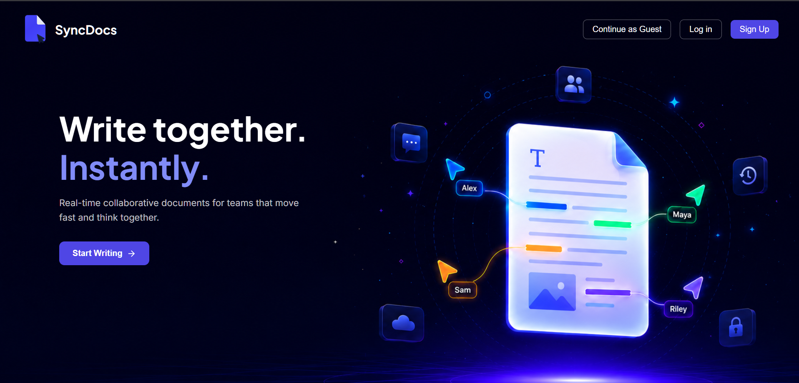
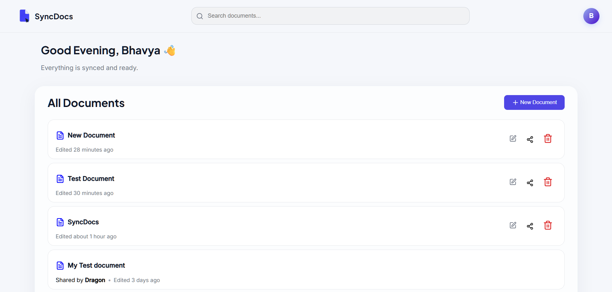
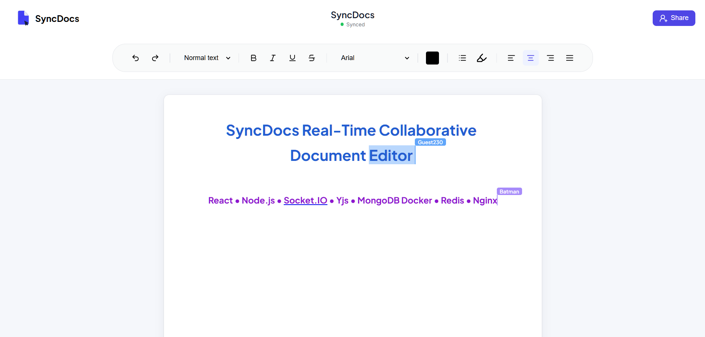
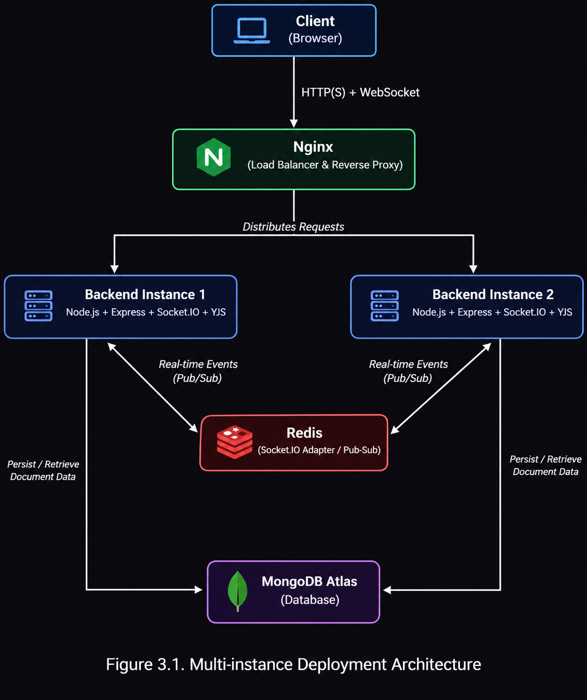

# SyncDocs

**SyncDocs** is a production-oriented collaborative document editor inspired by Google Docs built using the MERN stack, Yjs CRDTs, Socket.IO, Redis, Docker, and Nginx. Multiple people can open the same document and see each other's edits, cursors, and presence live.

`React` • `Node.js` • `Express` • `MongoDB` • `Socket.IO` • `Yjs` • `Docker` • `Redis` • `Nginx`

📊 **[Read the full performance evaluation →](./PERFORMANCE.md)** — a from-scratch benchmark comparing Native Node.js, Docker, Docker + Redis, and Docker + Redis + Nginx, including a real diagnostic investigation into a memory/connection-handling bug found and fixed during testing.

---

## Key Highlights

- Google Docs-style collaborative editor using CRDT-based sync (Yjs), not naive last-write-wins
- Horizontally scalable architecture using Redis Pub/Sub and Nginx load balancing
- Dockerized deployment, tested across four progressively production-like configurations
- Custom-built load testing harness alongside k6, covering HTTP, WebSocket, and connection-scale benchmarks
- Root-cause investigation of a real scalability issue (memory growth under concurrent document edits) found during benchmarking — see [PERFORMANCE.md](./PERFORMANCE.md)

---

## Table of Contents

- [Live Demo](#live-demo)
- [What It Does](#what-it-does)
- [Why I Built This](#why-i-built-this)
- [Features](#features)
- [Architecture](#architecture)
- [Deployment Configurations](#deployment-configurations)
- [Tech Stack](#tech-stack)
- [Getting Started](#getting-started)
- [Running with Redis (multi-instance mode)](#running-with-redis-multi-instance-mode)
- [Running the Benchmarks](#running-the-benchmarks)
- [Debug Utilities](#debug-utilities)
- [Project Structure](#project-structure)
- [Performance](#performance)
- [Challenges Solved](#challenges-solved)
- [Future Improvements](#future-improvements)
- [Demo](#demo)

---

## Live Demo

- **Frontend:** [Open SyncDocs](https://sync-docs-app.vercel.app/)
- **Backend API:** [Open API health endpoint](https://syncdocs-backend-spzf.onrender.com)
- **Performance Report:** [PERFORMANCE.md](./PERFORMANCE.md)

---

## Screenshots

<p align="center">
  
</p>

<p align="center">
  
</p>

<p align="center">
  
</p>

---

## What It Does

SyncDocs lets anyone create a document, share a link, and collaborate with others in real time — no page refreshes, no conflicting edits, no lost work. Two people can type in the same paragraph at the same time and the document converges correctly for both of them, thanks to a CRDT (Conflict-free Replicated Data Type) syncing model rather than naive "last write wins" logic.

It also supports a **guest mode**: anyone can start editing a document instantly without creating an account, and claim it later by signing up.

## Why I Built This

Most collaborative-editor tutorials stop once real-time synchronization is working. This project goes further: exploring production-oriented deployment with Docker, Redis Pub/Sub, and Nginx, then benchmarking each stage to understand the actual trade-offs between a native setup and a containerized, horizontally scaled one — including finding and fixing a real scalability bug along the way, documented in full in [PERFORMANCE.md](./PERFORMANCE.md).

## Features

**Core**
- 🔐 **Authentication** — register, log in, and log out with JWT authentication stored in secure, HTTP-only cookies
- 📝 **Real-time collaborative editing** — powered by Yjs + Tiptap, with live cursors and presence (who else is in the document, and where)
- 👤 **Guest access** — start editing without an account; claim the document later by signing up or logging in
- 📤 **Document sharing** — generate a shareable link per document, with configurable view or edit permissions
- 📊 **Dashboard** — see all documents you own or collaborate on, sorted by most recently updated

**Infrastructure**
- 🐳 **Dockerized** — backend and its dependencies run in containers
- 🔄 **Horizontally scalable** — multiple backend instances behind Nginx, kept in sync via Redis Pub/Sub, so the app isn't limited to a single server
- 📈 **Benchmarked** — every deployment stage (native, Docker, Docker+Redis, Docker+Redis+Nginx) load-tested and compared

## Architecture

In its scaled-out configuration, SyncDocs runs behind an Nginx reverse proxy distributing traffic across multiple backend instances, with Redis Pub/Sub keeping real-time events (document edits, cursor positions, presence) in sync across those instances, and MongoDB Atlas as shared persistent storage.

<p align="center">
  
</p>

*Client connects through Nginx → routed to one of two backend instances → real-time events are published to Redis → Redis fans the event out to the other instance(s) → every connected client stays in sync regardless of which backend instance it's attached to.*

For the full breakdown of why this architecture matters (and how it performs), see [PERFORMANCE.md](./PERFORMANCE.md).

## Deployment Configurations

The repository supports multiple deployment configurations, each benchmarked independently (full results in [PERFORMANCE.md](./PERFORMANCE.md)):

| Configuration | Purpose |
|---|---|
| Native | Local development |
| Docker | Containerized single-instance deployment |
| Docker + Redis | Multi-instance synchronization |
| Docker + Redis + Nginx | Load-balanced, horizontally scaled deployment |

> **Note:** Docker, Redis, and Nginx are optional deployment modes provided to demonstrate and benchmark horizontal scaling. The application runs normally without them in the standard single-instance (native) configuration.

## Tech Stack

| Layer | Technology |
|---|---|
| Frontend | React, Tiptap |
| Real-time sync | Socket.IO, Yjs, y-protocols |
| Backend | Node.js, Express 5 |
| Database | MongoDB Atlas (Mongoose) |
| Scaling | Redis (ioredis, Pub/Sub) |
| Reverse proxy / load balancing | Nginx |
| Deployment | Docker, Docker Compose |
| Auth | JWT (jsonwebtoken), bcrypt |
| Validation / Logging | Joi, Winston |
| Benchmarking | k6 (HTTP), custom Node.js harness (WebSocket / collaboration / connection-scale) |

## Getting Started

These steps get SyncDocs running locally in its simplest configuration: one backend instance, no Redis, no Nginx.

### Prerequisites

- [Node.js](https://nodejs.org/) v20 or later
- npm
- A [MongoDB Atlas](https://www.mongodb.com/atlas) connection string (or a local MongoDB instance)

### 1. Clone the repository

```bash
git clone https://github.com/Blaziator/syncdocs.git
cd syncdocs
```

### 2. Set up the backend

```bash
cd Backend
npm install
```

Create a `.env` file in `Backend/` with the following variables:

```env
PORT=8080
MONGODB_URI=your_mongodb_connection_string
CLIENT_URL=http://localhost:5173
JWT_SECRET=your_jwt_secret
NODE_ENV=development
USE_REDIS=false
DISABLE_RATE_LIMIT=false
# Required only when USE_REDIS=true
REDIS_URL=your_upstash_redis_string
```

Start the backend:

```bash
npm run dev
```

The API will be running at `http://localhost:8080`.

### 3. Set up the frontend

```bash
cd ../Frontend
npm install
```

Create a `.env` file in `Frontend/` with the following variables:

```env
VITE_SOCKET_URL=http://localhost:8080
VITE_API_URL=http://localhost:8080/api
```

Start the frontend:

```bash
npm run dev
```

The app will be running at `http://localhost:5173` (or whichever port Vite reports).

Open that URL in two different browser windows (or one normal + one incognito), create a document in one, share its link, and open it in the other to see real-time sync in action.

## Running with Redis (multi-instance mode)

SyncDocs includes a Docker Compose setup to run two backend instances behind Redis, simulating a horizontally scaled production deployment on your local machine.

```bash
docker compose -f docker/docker-compose.redis.yml up --build
```

This spins up:
- Two backend instances (each connected to the same Redis and MongoDB)
- Redis, coordinating real-time events between the two instances

Point your frontend at either backend instance, or in front of both via Nginx if you're also testing that layer — a client connected to Instance 1 will still see edits made by a client connected to Instance 2, live, because Redis propagates the event between them.

### Docker-only (single instance)

```bash
docker compose -f docker/docker-compose.docker.yml up --build
```

## Running the Benchmarks

The repository includes both HTTP (k6) and custom collaboration/connection-scale benchmark suites, run once per deployment stage (`baseline`, `docker`, `redis`, `nginx`).

### Custom collaboration & connection-scale benchmarks

From `Backend/loadtest/custom/`:

```bash
# Collaboration/merge-latency benchmark — <stage> <clients> <rounds>
node scripts/simulateClients.js redis 10 20
node scripts/simulateClients.js redis 50 100
node scripts/simulateClients.js redis 100 200

# Connection-scale benchmark — <stage>
node scripts/simulateConnectionScale.js baseline

# Generate a summary report from multiple runs — <stage> <test>
node scripts/generateSummary.js baseline connection-scale
```

Swap `redis`/`baseline` for `docker` or `nginx` to benchmark a different stage.

### k6 HTTP benchmarks

From `Backend/loadtest/k6/`:

```bash
k6 run -e ENVIRONMENT=docker scripts/auth-flow.js
node generate-summary.js docker auth
```

Swap `docker` for `baseline`, `redis`, or `nginx`, and the script name for the test you're running (auth, CRUD, guest, rate-limit).

All generated reports land under `Backend/loadtest/*/results/<stage>/<test>/`. Full methodology and analysis: [PERFORMANCE.md](./PERFORMANCE.md).

## Debug Utilities

The backend includes an `instance2` script for running a second backend instance locally against a separate env file — used to verify that requests are actually being distributed across backend instances when testing the Nginx load balancer:

Start the backend:

```bash
cd Backend
npm run instance2
```

Start the frontend:

```bash
cd Frontend
npm run instance2
```

Intended for development and benchmarking only, not part of the production start flow.

## Project Structure

```
SyncDocs/
├── assets/
├── Backend/
├── docker/
├── Frontend/
├── PERFORMANCE.md
└── README.md
```

## Performance

SyncDocs was benchmarked across four progressively production-like deployment stages — Native Node.js, Docker, Docker + Redis, and Docker + Redis + Nginx — covering authentication, CRUD, guest access, rate limiting, real-time document sync, and connection scaling under load.

Highlights:
- HTTP endpoints (auth, CRUD, guest, rate limiting) stayed stable and fast across every stage
- Real-time collaboration under high concurrency exposed a genuine bug — a benchmark hammering hundreds of simulated clients into a single shared document caused memory to balloon from 64 MB to nearly 870 MB — which was root-caused and fixed
- Full methodology, raw data, graphs, and the diagnostic investigation are documented in **[PERFORMANCE.md](./PERFORMANCE.md)**

## Challenges Solved

- **Connection failures under load** — early connection-scale tests showed a high rate of unexpected disconnects. Root-caused to hundreds of simulated clients all editing a single shared document, causing unbounded server-side memory growth (64 MB → ~868 MB); fixed by distributing clients across a pool of independent test documents. Full investigation in [PERFORMANCE.md §6](./PERFORMANCE.md).
- **Cross-instance real-time sync** — keeping Socket.IO events consistent across multiple backend instances, solved with Socket.IO and Redis Pub/Sub.

## Future Improvements

- Display the names and avatars of all collaborators currently editing a document
- Allow document owners to revoke collaborator access directly from the dashboard
- Display collaborator lists for every shared document in the dashboard
- Document version history and rollback
- Offline editing with automatic synchronization
- Operational analytics dashboard
- Kubernetes deployment
- CI/CD pipeline

## Demo 
[Watch the SyncDocs demo video](https://drive.google.com/file/d/1LBZYA48xPQOJEkL1ApvIH_dgcZEAhM3_/view?usp=sharing)

---

Built by [Bhavya](https://github.com/Blaziator) — [LinkedIn](https://linkedin.com/in/blaziator)